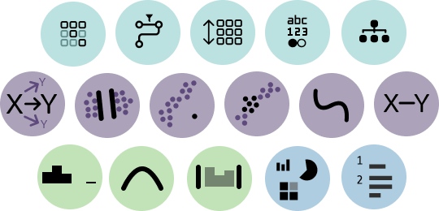

##

Have you ever wondered how data scientists use interactive visualizations to explore data and generate insights? We've completed an investigation of 13 data scientists to shed some light on this question.

We are motivated to understand how data scientists use a combination of code, statics graphs, and interaction techniques to explore a dataset, and we recruited professional data scientists to perform two exploratory data analysis (EDA) tasks using a Jupyter notebook with a new visualization toolkit called [Altair Express (ALX)](https://www.dylanwootton.com/projects/altairExpress). The toolkit allows users to create both static and interactive visualizations using a high-level grammar of graphics based around [instrumental interaction](https://dl.acm.org/doi/10.1145/332040.332473). We researchers recorded the participants' utterances, interaction traces, notebook activity, and analyzed them using content and thematic analyses.

Some of the main findings we observed were:

Data scientists make various types of utterances during EDA, ranging from comments about the data quality, the distributions of variables, the relationships between variables, and their own analysis process. We developed a codebook with 16 detail codes to better decompose the types of inferences analysts make during analyses.

Data scientists are influenced by the interactivity of the visualizations in their hypothesis generation and exploration. We observed that interaction affordances (such as sliders or multi-select) and example galleries (showing different chart types) can spark new analytical questions – whereby the analysts translate interactive features into new hypotheses to investigate. We also found that interaction can lead to more complex multivariate analyses and comparisons.

Data scientists face challenges and trade-offs in using interactive visualizations for EDA. The researchers identified some common patterns of behavior, such as persevering with perceptually ineffective or cognitively demanding visualizations, experiencing sunk cost fallacy or confirmation bias, and balancing between serendipitous discovery and analytical objectives.

Our study seeks to contribute to the understanding of how interactive visualizations affect EDA behavior in computational notebooks. It also suggests some implications for future research and tool design, such as developing more effective example galleries, facilitating seamless transitions between code and charts, and supporting reproducibility and communication of EDA results.

If you are interested in learning more about this study, we'll be publishing our pre-print later this year.
